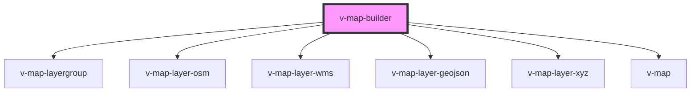

# v-map-builder

<!-- Auto Generated Below -->

## Properties

| Property    | Attribute   | Description | Type      | Default     |
| ----------- | ----------- | ----------- | --------- | ----------- |
| `mapconfig` | `mapconfig` |             | `unknown` | `undefined` |

## Events

| Event         | Description | Type                                                   |
| ------------- | ----------- | ------------------------------------------------------ |
| `configError` |             | `CustomEvent<{ message: string; errors?: string[]; }>` |
| `configReady` |             | `CustomEvent<BuilderConfig>`                           |

## Shadow Parts

| Part      | Description |
| --------- | ----------- |
| `"mount"` |             |

## Dependencies

### Depends on

- [v-map-layergroup](../v-map-layergroup)
- [v-map-layer-osm](../v-map-layer-osm)
- [v-map-layer-wms](../v-map-layer-wms)
- [v-map-layer-geojson](../v-map-layer-geojson)
- [v-map-layer-xyz](../v-map-layer-xyz)
- [v-map](../v-map)

### Graph

----------------------------------------------

*Built with [StencilJS](https://stenciljs.com/)*
