# v-map-builder

<!-- Auto Generated Below -->

## Overview

A component that builds map configurations dynamically from JSON/YAML configuration scripts.

## Properties

| Property    | Attribute   | Description                                                                                              | Type      | Default     |
| ----------- | ----------- | -------------------------------------------------------------------------------------------------------- | --------- | ----------- |
| `mapconfig` | `mapconfig` | Configuration object for the map builder. Can be any structure that will be normalized to BuilderConfig. | `unknown` | `undefined` |

## Events

| Event         | Description                                                                                | Type                                                   |
| ------------- | ------------------------------------------------------------------------------------------ | ------------------------------------------------------ |
| `configError` | Event emitted when there is an error parsing the map configuration.                        | `CustomEvent<{ message: string; errors?: string[]; }>` |
| `configReady` | Event emitted when the map configuration has been successfully parsed and is ready to use. | `CustomEvent<BuilderConfig>`                           |

## Shadow Parts

| Part      | Description                                                           |
| --------- | --------------------------------------------------------------------- |
| `"mount"` | The container element where the generated map and layers are mounted. |

## Dependencies

### Depends on

- [v-map-style](../v-map-style)
- [v-map-layergroup](../v-map-layergroup)
- [v-map-layer-osm](../v-map-layer-osm)
- [v-map-layer-wms](../v-map-layer-wms)
- [v-map-layer-geojson](../v-map-layer-geojson)
- [v-map-layer-xyz](../v-map-layer-xyz)
- [v-map-layer-terrain](../v-map-layer-terrain)
- [v-map-layer-wfs](../v-map-layer-wfs)
- [v-map-layer-wcs](../v-map-layer-wcs)
- [v-map-layer-google](../v-map-layer-google)
- [v-map-layer-geotiff](../v-map-layer-geotiff)
- [v-map-layer-tile3d](../v-map-layer-tile3d)
- [v-map-layer-scatterplot](../v-map-layer-scatterplot)
- [v-map-layer-wkt](../v-map-layer-wkt)
- [v-map](../v-map)

### Graph

```mermaid
graph TD;
  v-map-builder --> v-map-style
  v-map-builder --> v-map-layergroup
  v-map-builder --> v-map-layer-osm
  v-map-builder --> v-map-layer-wms
  v-map-builder --> v-map-layer-geojson
  v-map-builder --> v-map-layer-xyz
  v-map-builder --> v-map-layer-terrain
  v-map-builder --> v-map-layer-wfs
  v-map-builder --> v-map-layer-wcs
  v-map-builder --> v-map-layer-google
  v-map-builder --> v-map-layer-geotiff
  v-map-builder --> v-map-layer-tile3d
  v-map-builder --> v-map-layer-scatterplot
  v-map-builder --> v-map-layer-wkt
  v-map-builder --> v-map
  style v-map-builder fill:#f9f,stroke:#333,stroke-width:4px
```

----------------------------------------------

*Built with [StencilJS](https://stenciljs.com/)*
