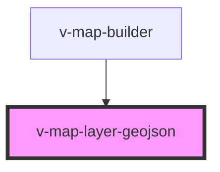

# v-map-layer-geojson

<!-- Auto Generated Below -->

## Properties

| Property        | Attribute        | Description                                                                  | Type      | Default     |
| --------------- | ---------------- | ---------------------------------------------------------------------------- | --------- | ----------- |
| `fillColor`     | `fill-color`     | Fill color for polygon geometries (CSS color value)                          | `string`  | `undefined` |
| `fillOpacity`   | `fill-opacity`   | Fill opacity for polygon geometries (0-1)                                    | `number`  | `undefined` |
| `geojson`       | `geojson`        | Prop, die du intern nutzt/weiterverarbeitest                                 | `unknown` | `undefined` |
| `iconSize`      | `icon-size`      | Icon size as [width, height] in pixels (comma-separated string like "32,32") | `string`  | `undefined` |
| `iconUrl`       | `icon-url`       | Icon URL for point features (alternative to pointColor/pointRadius)          | `string`  | `undefined` |
| `opacity`       | `opacity`        | Opazität der geojson-Kacheln (0–1).                                          | `number`  | `1.0`       |
| `pointColor`    | `point-color`    | Point color for point geometries (CSS color value)                           | `string`  | `undefined` |
| `pointRadius`   | `point-radius`   | Point radius for point geometries in pixels                                  | `number`  | `undefined` |
| `strokeColor`   | `stroke-color`   | Stroke color for lines and polygon outlines (CSS color value)                | `string`  | `undefined` |
| `strokeOpacity` | `stroke-opacity` | Stroke opacity (0-1)                                                         | `number`  | `undefined` |
| `strokeWidth`   | `stroke-width`   | Stroke width in pixels                                                       | `number`  | `undefined` |
| `textColor`     | `text-color`     | Text color for labels (CSS color value)                                      | `string`  | `undefined` |
| `textProperty`  | `text-property`  | Text property name from feature properties to display as label               | `string`  | `undefined` |
| `textSize`      | `text-size`      | Text size for labels in pixels                                               | `number`  | `undefined` |
| `url`           | `url`            | URL to fetch GeoJSON data from. Alternative to providing data via slot.      | `string`  | `null`      |
| `visible`       | `visible`        | Whether the layer is visible on the map.                                     | `boolean` | `true`      |
| `zIndex`        | `z-index`        | Z-index for layer stacking order. Higher values render on top.               | `number`  | `1000`      |

## Methods

### `getLayerId() => Promise<string>`

Returns the internal layer ID used by the map provider.

#### Returns

Type: `Promise<string>`

## Dependencies

### Used by

 - [v-map-builder](../v-map-builder)

### Graph

----------------------------------------------

*Built with [StencilJS](https://stenciljs.com/)*
