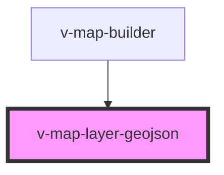

# v-map-layer-geojson

<!-- Auto Generated Below -->

## Properties

| Property  | Attribute | Description                                  | Type      | Default     |
| --------- | --------- | -------------------------------------------- | --------- | ----------- |
| `geojson` | `geojson` | Prop, die du intern nutzt/weiterverarbeitest | `unknown` | `undefined` |
| `opacity` | `opacity` | Opazität der geojson-Kacheln (0–1).          | `number`  | `1.0`       |
| `url`     | `url`     |                                              | `string`  | `null`      |
| `visible` | `visible` |                                              | `boolean` | `true`      |
| `zIndex`  | `z-index` |                                              | `number`  | `1000`      |

## Methods

### `getLayerId() => Promise<string>`

#### Returns

Type: `Promise<string>`

## Dependencies

### Used by

 - [v-map-builder](../v-map-builder)

### Graph

----------------------------------------------

*Built with [StencilJS](https://stenciljs.com/)*
