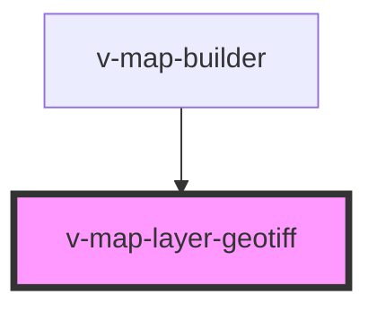

# v-map-layer-geotiff

<!-- Auto Generated Below -->

## Properties

| Property     | Attribute   | Description                                                                                                | Type                 | Default |
| ------------ | ----------- | ---------------------------------------------------------------------------------------------------------- | -------------------- | ------- |
| `colorMap`   | `color-map` | ColorMap für die Visualisierung (kann entweder ein vordefinierter Name oder eine GeoStyler ColorMap sein). | `ColorMap \| string` | `null`  |
| `nodata`     | `nodata`    | NoData Values to discard (overriding any nodata values in the metadata).                                   | `number`             | `null`  |
| `opacity`    | `opacity`   | Opazität der GeoTIFF-Kacheln (0–1).                                                                        | `number`             | `1.0`   |
| `url`        | `url`       | URL to the GeoTIFF file to be displayed on the map.                                                        | `string`             | `null`  |
| `valueRange` | --          | Value range for colormap normalization [min, max].                                                         | `[number, number]`   | `null`  |
| `visible`    | `visible`   | Sichtbarkeit des Layers                                                                                    | `boolean`            | `true`  |
| `zIndex`     | `z-index`   | Z-index for layer stacking order. Higher values render on top.                                             | `number`             | `100`   |

## Events

| Event   | Description                                        | Type                |
| ------- | -------------------------------------------------- | ------------------- |
| `ready` | Wird ausgelöst, wenn der GeoTIFF-Layer bereit ist. | `CustomEvent<void>` |

## Methods

### `getLayerId() => Promise<string>`

Returns the internal layer ID used by the map provider.

#### Returns

Type: `Promise<string>`

## Dependencies

### Used by

 - [v-map-builder](../v-map-builder)

### Graph

----------------------------------------------

*Built with [StencilJS](https://stenciljs.com/)*
