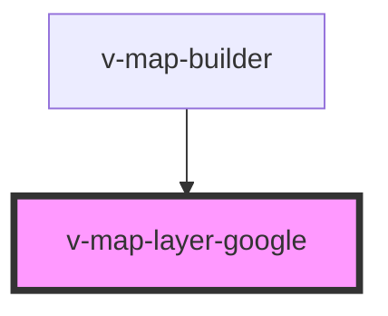

# v-map-layer-google

<!-- Auto Generated Below -->

## Overview

Google Maps Basemap Layer

## Properties

| Property    | Attribute    | Description                                                                                              | Type                                                    | Default     |
| ----------- | ------------ | -------------------------------------------------------------------------------------------------------- | ------------------------------------------------------- | ----------- |
| `apiKey`    | `api-key`    | Google Maps API-Schlüssel.                                                                               | `string`                                                | `undefined` |
| `language`  | `language`   | Sprach-Lokalisierung (BCP-47, z. B. "de", "en-US").                                                      | `string`                                                | `undefined` |
| `libraries` | `libraries`  | Google Maps libraries to load (comma-separated string).                                                  | `string`                                                | `undefined` |
| `loadState` | `load-state` | Current load state of the layer.                                                                         | `"error" \| "idle" \| "loading" \| "ready"`             | `'idle'`    |
| `mapType`   | `map-type`   | Karten-Typ: "roadmap" \| "satellite" \| "hybrid" \| "terrain".                                           | `"hybrid" \| "roadmap" \| "satellite" \| "terrain"`     | `'roadmap'` |
| `maxZoom`   | `max-zoom`   | Maximum zoom level for the layer.                                                                        | `number`                                                | `undefined` |
| `opacity`   | `opacity`    | Opazität des Layers (0–1).                                                                               | `number`                                                | `1.0`       |
| `region`    | `region`     | Region-Bias (ccTLD/Region-Code, z. B. "DE", "US"). Beeinflusst Labels/Suchergebnisse.                    | `string`                                                | `undefined` |
| `scale`     | `scale`      | Scale factor for tile display.                                                                           | `"scaleFactor1x" \| "scaleFactor2x" \| "scaleFactor4x"` | `undefined` |
| `styles`    | `styles`     | Custom styles for the Google Map (JSON array of styling objects). Can be passed as JSON string or array. | `Record<string, unknown>[] \| string`                   | `undefined` |
| `visible`   | `visible`    | Sichtbarkeit des Layers.                                                                                 | `boolean`                                               | `true`      |

## Events

| Event   | Description                                                                 | Type                |
| ------- | --------------------------------------------------------------------------- | ------------------- |
| `ready` | Signalisiert, dass der Google-Layer bereit ist. `detail` enthält Metadaten. | `CustomEvent<void>` |

## Methods

### `getError() => Promise<VMapErrorDetail | undefined>`

Returns the last error detail, if any.

#### Returns

Type: `Promise<VMapErrorDetail>`

## Dependencies

### Used by

 - [v-map-builder](../v-map-builder)

### Graph

----------------------------------------------

*Built with [StencilJS](https://stenciljs.com/)*
