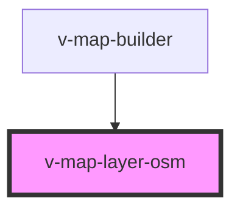

# v-map-layer-osm

<!-- Auto Generated Below -->

## Properties

| Property  | Attribute | Description                     | Type      | Default                            |
| --------- | --------- | ------------------------------- | --------- | ---------------------------------- |
| `opacity` | `opacity` | Opazität der OSM-Kacheln (0–1). | `number`  | `1.0`                              |
| `url`     | `url`     |                                 | `string`  | `'https://tile.openstreetmap.org'` |
| `visible` | `visible` | Sichtbarkeit des Layers         | `boolean` | `true`                             |
| `zIndex`  | `z-index` |                                 | `number`  | `10`                               |

## Events

| Event   | Description                                    | Type                |
| ------- | ---------------------------------------------- | ------------------- |
| `ready` | Wird ausgelöst, wenn der OSM-Layer bereit ist. | `CustomEvent<void>` |

## Methods

### `getLayerId() => Promise<string>`

#### Returns

Type: `Promise<string>`

## Dependencies

### Used by

 - [v-map-builder](../v-map-builder)

### Graph

----------------------------------------------

*Built with [StencilJS](https://stenciljs.com/)*
