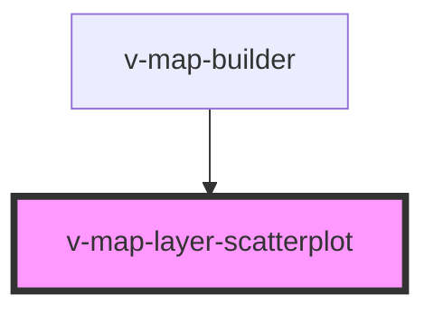

# v-map-layer-scatterplot

<!-- Auto Generated Below -->

## Properties

| Property       | Attribute        | Description                                                                                                            | Type                                          | Default     |
| -------------- | ---------------- | ---------------------------------------------------------------------------------------------------------------------- | --------------------------------------------- | ----------- |
| `data`         | `data`           | Datenquelle für Punkte. Erwartet Objekte mit mindestens einer Position in [lon, lat]. Zusätzliche Felder sind erlaubt. | `string`                                      | `undefined` |
| `getFillColor` | `get-fill-color` | Funktion zur Bestimmung der Füllfarbe je Punkt. Rückgabe z. B. [r,g,b] oder CSS-Farbe (providerabhängig).              | `[number, number, number, number?] \| string` | `'#3388ff'` |
| `getRadius`    | `get-radius`     | Funktion/konstanter Wert für den Punkt-Radius.                                                                         | `number`                                      | `1000`      |
| `loadState`    | `load-state`     | Current load state of the layer.                                                                                       | `"error" \| "idle" \| "loading" \| "ready"`   | `'idle'`    |
| `opacity`      | `opacity`        | Globale Opazität (0–1).                                                                                                | `number`                                      | `1.0`       |
| `url`          | `url`            | Optionaler Remote-Pfad für JSON/CSV/GeoJSON, der zu `data` geladen wird.                                               | `string`                                      | `undefined` |
| `visible`      | `visible`        | Sichtbarkeit des Layers.                                                                                               | `boolean`                                     | `true`      |

## Events

| Event   | Description                                               | Type                |
| ------- | --------------------------------------------------------- | ------------------- |
| `ready` | Wird ausgelöst, sobald der Scatterplot registriert wurde. | `CustomEvent<void>` |

## Methods

### `getError() => Promise<VMapErrorDetail | undefined>`

Returns the last error detail, if any.

#### Returns

Type: `Promise<VMapErrorDetail>`

## Dependencies

### Used by

 - [v-map-builder](../v-map-builder)

### Graph

----------------------------------------------

*Built with [StencilJS](https://stenciljs.com/)*
