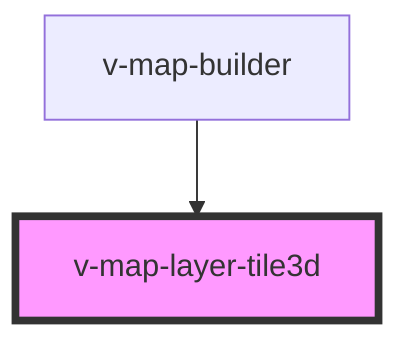

# v-map-layer-tile3d

<!-- Auto Generated Below -->

## Properties

| Property           | Attribute         | Description                                                  | Type                | Default     |
| ------------------ | ----------------- | ------------------------------------------------------------ | ------------------- | ----------- |
| `opacity`          | `opacity`         | Global opacity factor (0-1).                                 | `number`            | `1`         |
| `tilesetOptions`   | `tileset-options` | Optional JSON string or object with Cesium3DTileset options. | `string \| unknown` | `undefined` |
| `url` _(required)_ | `url`             | URL pointing to the Cesium 3D Tileset.                       | `string`            | `undefined` |
| `visible`          | `visible`         | Whether the tileset should be visible.                       | `boolean`           | `true`      |
| `zIndex`           | `z-index`         | Z-index used for ordering tilesets.                          | `number`            | `1000`      |

## Events

| Event   | Description                                  | Type                |
| ------- | -------------------------------------------- | ------------------- |
| `ready` | Fired once the tileset layer is initialised. | `CustomEvent<void>` |

## Methods

### `isReady() => Promise<boolean>`

Indicates whether the tileset has been initialised and added to the map.

#### Returns

Type: `Promise<boolean>`

## Dependencies

### Used by

 - [v-map-builder](../v-map-builder)

### Graph

----------------------------------------------

*Built with [StencilJS](https://stenciljs.com/)*
