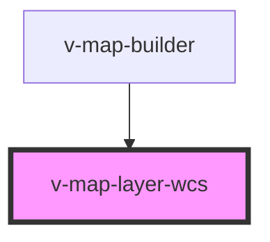

# v-map-layer-wcs

<!-- Auto Generated Below -->

## Properties

| Property                    | Attribute       | Description                                   | Type      | Default        |
| --------------------------- | --------------- | --------------------------------------------- | --------- | -------------- |
| `coverageName` _(required)_ | `coverage-name` | Coverage-Name/ID.                             | `string`  | `undefined`    |
| `format`                    | `format`        | Ausgabeformat, z. B. image/tiff.              | `string`  | `'image/tiff'` |
| `opacity`                   | `opacity`       | Opazität (0–1).                               | `number`  | `1`            |
| `params`                    | `params`        | Zusätzliche Parameter als JSON-String.        | `string`  | `undefined`    |
| `projection`                | `projection`    | Projektion (Projection) für die Quelle.       | `string`  | `undefined`    |
| `resolutions`               | `resolutions`   | Auflösungen als JSON-Array, z. B. [1000,500]. | `string`  | `undefined`    |
| `url` _(required)_          | `url`           | Basis-URL des WCS-Dienstes.                   | `string`  | `undefined`    |
| `version`                   | `version`       | WCS-Version.                                  | `string`  | `'1.1.0'`      |
| `visible`                   | `visible`       | Sichtbarkeit des Layers.                      | `boolean` | `true`         |
| `zIndex`                    | `z-index`       | Z-Index für die Darstellung.                  | `number`  | `1000`         |

## Methods

### `isReady() => Promise<boolean>`

Gibt `true` zurück, sobald der Layer initialisiert wurde.

#### Returns

Type: `Promise<boolean>`

## Dependencies

### Used by

 - [v-map-builder](../v-map-builder)

### Graph

----------------------------------------------

*Built with [StencilJS](https://stenciljs.com/)*
