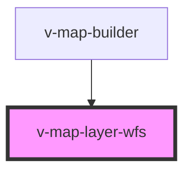

# v-map-layer-wfs

<!-- Auto Generated Below -->

## Properties

| Property                | Attribute       | Description                              | Type                                        | Default              |
| ----------------------- | --------------- | ---------------------------------------- | ------------------------------------------- | -------------------- |
| `loadState`             | `load-state`    | Current load state of the layer.         | `"error" \| "idle" \| "loading" \| "ready"` | `'idle'`             |
| `opacity`               | `opacity`       | Opazität (0–1).                          | `number`                                    | `1`                  |
| `outputFormat`          | `output-format` | Ausgabeformat, z. B. application/json.   | `string`                                    | `'application/json'` |
| `params`                | `params`        | Zusätzliche Parameter als JSON-String.   | `string`                                    | `undefined`          |
| `srsName`               | `srs-name`      | Ziel-Referenzsystem, Standard EPSG:3857. | `string`                                    | `'EPSG:3857'`        |
| `typeName` _(required)_ | `type-name`     | Feature-Typ (typeName) des WFS.          | `string`                                    | `undefined`          |
| `url` _(required)_      | `url`           | WFS Endpunkt (z. B. https://server/wfs). | `string`                                    | `undefined`          |
| `version`               | `version`       | WFS Version, Standard 1.1.0.             | `string`                                    | `'1.1.0'`            |
| `visible`               | `visible`       | Sichtbarkeit des Layers.                 | `boolean`                                   | `true`               |
| `zIndex`                | `z-index`       | Z-Index für Rendering.                   | `number`                                    | `1000`               |

## Methods

### `getError() => Promise<VMapErrorDetail | undefined>`

Returns the last error detail, if any.

#### Returns

Type: `Promise<VMapErrorDetail>`

### `isReady() => Promise<boolean>`

Gibt `true` zurück, sobald der Layer initialisiert wurde.

#### Returns

Type: `Promise<boolean>`

## Dependencies

### Used by

 - [v-map-builder](../v-map-builder)

### Graph

----------------------------------------------

*Built with [StencilJS](https://stenciljs.com/)*
