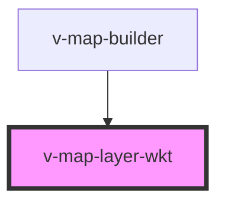

# v-map-layer-wkt

<!-- Auto Generated Below -->

## Properties

| Property        | Attribute        | Description                                                                  | Type                                        | Default     |
| --------------- | ---------------- | ---------------------------------------------------------------------------- | ------------------------------------------- | ----------- |
| `fillColor`     | `fill-color`     | Fill color for polygon geometries (CSS color value)                          | `string`                                    | `undefined` |
| `fillOpacity`   | `fill-opacity`   | Fill opacity for polygon geometries (0-1)                                    | `number`                                    | `undefined` |
| `iconSize`      | `icon-size`      | Icon size as [width, height] in pixels (comma-separated string like "32,32") | `string`                                    | `undefined` |
| `iconUrl`       | `icon-url`       | Icon URL for point features (alternative to pointColor/pointRadius)          | `string`                                    | `undefined` |
| `loadState`     | `load-state`     |                                                                              | `"error" \| "idle" \| "loading" \| "ready"` | `'idle'`    |
| `opacity`       | `opacity`        | Globale Opazität (0–1).                                                      | `number`                                    | `1.0`       |
| `pointColor`    | `point-color`    | Point color for point geometries (CSS color value)                           | `string`                                    | `undefined` |
| `pointRadius`   | `point-radius`   | Point radius for point geometries in pixels                                  | `number`                                    | `undefined` |
| `strokeColor`   | `stroke-color`   | Stroke color for lines and polygon outlines (CSS color value)                | `string`                                    | `undefined` |
| `strokeOpacity` | `stroke-opacity` | Stroke opacity (0-1)                                                         | `number`                                    | `undefined` |
| `strokeWidth`   | `stroke-width`   | Stroke width in pixels                                                       | `number`                                    | `undefined` |
| `textColor`     | `text-color`     | Text color for labels (CSS color value)                                      | `string`                                    | `undefined` |
| `textProperty`  | `text-property`  | Text property name from feature properties to display as label               | `string`                                    | `undefined` |
| `textSize`      | `text-size`      | Text size for labels in pixels                                               | `number`                                    | `undefined` |
| `url`           | `url`            | URL, von der eine WKT-Geometrie geladen wird (alternativ zu `wkt`).          | `string`                                    | `undefined` |
| `visible`       | `visible`        | Sichtbarkeit des Layers.                                                     | `boolean`                                   | `true`      |
| `wkt`           | `wkt`            | WKT-Geometrie (z. B. "POINT(11.57 48.14)" oder "POLYGON((...))").            | `string`                                    | `undefined` |
| `zIndex`        | `z-index`        | Z-index for layer stacking order. Higher values render on top.               | `number`                                    | `1000`      |

## Events

| Event   | Description                                         | Type                |
| ------- | --------------------------------------------------- | ------------------- |
| `ready` | Signalisiert, dass das WKT-Layer initialisiert ist. | `CustomEvent<void>` |

## Methods

### `getError() => Promise<VMapErrorDetail | undefined>`

#### Returns

Type: `Promise<VMapErrorDetail>`

### `getLayerId() => Promise<string>`

Returns the internal layer ID used by the map provider.

#### Returns

Type: `Promise<string>`

## Dependencies

### Used by

 - [v-map-builder](../v-map-builder)

### Graph

----------------------------------------------

*Built with [StencilJS](https://stenciljs.com/)*
