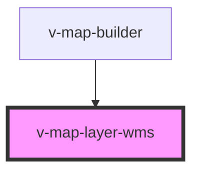

# v-map-layer-wms

<!-- Auto Generated Below -->

## Overview

OGC WMS Layer

## Properties

| Property              | Attribute     | Description                                                        | Type      | Default       |
| --------------------- | ------------- | ------------------------------------------------------------------ | --------- | ------------- |
| `format`              | `format`      | Bildformat des GetMap-Requests.                                    | `string`  | `'image/png'` |
| `layers` _(required)_ | `layers`      | Kommagetrennte Layer-Namen (z. B. "topp:states").                  | `string`  | `undefined`   |
| `opacity`             | `opacity`     | Globale Opazität des WMS-Layers (0–1).                             | `number`  | `1.0`         |
| `styles`              | `styles`      | WMS-`STYLES` Parameter (kommagetrennt).                            | `string`  | `undefined`   |
| `tiled`               | `tiled`       | Tiled/geslicete Requests verwenden (falls Server unterstützt).     | `boolean` | `true`        |
| `transparent`         | `transparent` | Transparente Kacheln anfordern.                                    | `boolean` | `true`        |
| `url` _(required)_    | `url`         | Basis-URL des WMS-Dienstes (GetMap-Endpunkt ohne Query-Parameter). | `string`  | `undefined`   |
| `visible`             | `visible`     | Sichtbarkeit des WMS-Layers.                                       | `boolean` | `true`        |
| `zIndex`              | `z-index`     |                                                                    | `number`  | `10`          |

## Events

| Event   | Description                                  | Type                |
| ------- | -------------------------------------------- | ------------------- |
| `ready` | Signalisiert, dass der WMS-Layer bereit ist. | `CustomEvent<void>` |

## Dependencies

### Used by

 - [v-map-builder](../v-map-builder)

### Graph

----------------------------------------------

*Built with [StencilJS](https://stenciljs.com/)*
