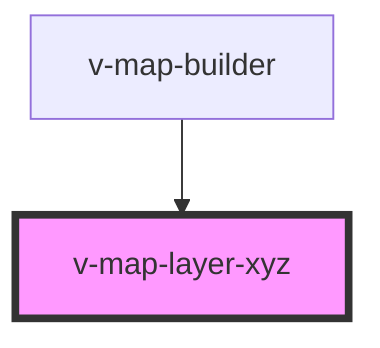

# v-map-layer-xyz

<!-- Auto Generated Below -->

## Overview

XYZ Tile Layer

## Properties

| Property           | Attribute      | Description                                                                           | Type                                        | Default     |
| ------------------ | -------------- | ------------------------------------------------------------------------------------- | ------------------------------------------- | ----------- |
| `attributions`     | `attributions` | Attributions-/Copyright-Text (HTML erlaubt).                                          | `string`                                    | `undefined` |
| `loadState`        | `load-state`   | Current load state of the layer.                                                      | `"error" \| "idle" \| "loading" \| "ready"` | `'idle'`    |
| `maxZoom`          | `max-zoom`     | Maximaler Zoomlevel, den der Tile-Server liefert.                                     | `number`                                    | `undefined` |
| `opacity`          | `opacity`      | Opazität (0–1).                                                                       | `number`                                    | `1.0`       |
| `subdomains`       | `subdomains`   | Subdomains für parallele Tile-Anfragen (z. B. "a,b,c").                               | `string`                                    | `undefined` |
| `tileSize`         | `tile-size`    | Größe einer Kachel in Pixeln.                                                         | `number`                                    | `undefined` |
| `url` _(required)_ | `url`          | URL-Template für Kacheln, z. B. "https://{s}.tile.openstreetmap.org/{z}/{x}/{y}.png". | `string`                                    | `undefined` |
| `visible`          | `visible`      | Sichtbarkeit des XYZ-Layers.                                                          | `boolean`                                   | `true`      |

## Events

| Event   | Description                                    | Type                |
| ------- | ---------------------------------------------- | ------------------- |
| `ready` | Wird ausgelöst, wenn der XYZ-Layer bereit ist. | `CustomEvent<void>` |

## Methods

### `getError() => Promise<VMapErrorDetail | undefined>`

Returns the last error detail, if any.

#### Returns

Type: `Promise<VMapErrorDetail>`

## Dependencies

### Used by

 - [v-map-builder](../v-map-builder)

### Graph

----------------------------------------------

*Built with [StencilJS](https://stenciljs.com/)*
