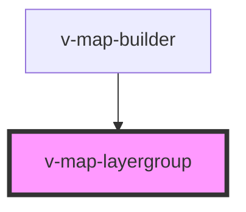

# v-map-layergroup

<!-- Auto Generated Below -->

## Properties

| Property    | Attribute   | Description                                                                                                  | Type      | Default |
| ----------- | ----------- | ------------------------------------------------------------------------------------------------------------ | --------- | ------- |
| `basemapid` | `basemapid` | Base map identifier for this layer group. When set, layers in this group will be treated as base map layers. | `string`  | `null`  |
| `opacity`   | `opacity`   | Globale Opazität (0–1) für alle Kinder.                                                                      | `number`  | `1.0`   |
| `visible`   | `visible`   | Sichtbarkeit der gesamten Gruppe.                                                                            | `boolean` | `true`  |

## Methods

### `getGroupId() => Promise<string>`

#### Returns

Type: `Promise<string>`

## Dependencies

### Used by

 - [v-map-builder](../v-map-builder)

### Graph

----------------------------------------------

*Built with [StencilJS](https://stenciljs.com/)*
