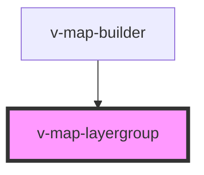

# v-map-layergroup

<!-- Auto Generated Below -->

## Properties

| Property    | Attribute   | Description                                                                                                  | Type      | Default |
| ----------- | ----------- | ------------------------------------------------------------------------------------------------------------ | --------- | ------- |
| `basemapid` | `basemapid` | Base map identifier for this layer group. When set, layers in this group will be treated as base map layers. | `string`  | `null`  |
| `opacity`   | `opacity`   | Globale Opazität (0–1) für alle Kinder.                                                                      | `number`  | `1.0`   |
| `visible`   | `visible`   | Sichtbarkeit der gesamten Gruppe.                                                                            | `boolean` | `true`  |

## Methods

### `addLayer(layerConfig: LayerConfig, layerElementId?: string) => Promise<string>`

Fügt ein Kind-Layer zur Gruppe hinzu.

#### Parameters

| Name             | Type                                                                                                                                                                                                                                                                                                                                                                                                                                                                                                                                                                                                                                                                                                                                                                                                                                                                                                                                                                                                                                                                                                                                                                                                                                                                                                                                                                                                                                                                                                                                                                                                                                                                                                                                                                                                                                                                                                                                                                                                                                                                                                                                                                                                                   | Description |
| ---------------- | ---------------------------------------------------------------------------------------------------------------------------------------------------------------------------------------------------------------------------------------------------------------------------------------------------------------------------------------------------------------------------------------------------------------------------------------------------------------------------------------------------------------------------------------------------------------------------------------------------------------------------------------------------------------------------------------------------------------------------------------------------------------------------------------------------------------------------------------------------------------------------------------------------------------------------------------------------------------------------------------------------------------------------------------------------------------------------------------------------------------------------------------------------------------------------------------------------------------------------------------------------------------------------------------------------------------------------------------------------------------------------------------------------------------------------------------------------------------------------------------------------------------------------------------------------------------------------------------------------------------------------------------------------------------------------------------------------------------------------------------------------------------------------------------------------------------------------------------------------------------------------------------------------------------------------------------------------------------------------------------------------------------------------------------------------------------------------------------------------------------------------------------------------------------------------------------------------------------------- | ----------- |
| `layerConfig`    | `{ type: "geojson"; url?: string; geojson?: string; style?: StyleConfig; groupId?: string; zIndex?: number; visible?: boolean; opacity?: number; } \| { type: "osm"; groupId?: string; url?: string; opacity?: number; zIndex?: number; visible?: boolean; } \| { type: "geotiff"; groupId?: string; url?: string; opacity?: number; zIndex?: number; visible?: boolean; } \| { type: "xyz"; url: string; attributions?: string \| string[]; maxZoom?: number; options?: Record<string, unknown>; groupId?: string; zIndex?: number; visible?: boolean; opacity?: number; } \| { type: "arcgis"; url: string; groupId?: string; } \| { type: "google"; apiKey: string; mapType?: googleMapType; scale?: "scaleFactor1x" \| "scaleFactor2x"; highDpi?: boolean; opacity?: number; visible?: boolean; groupId?: string; zIndex?: number; maxZoom?: number; styles?: string; language?: string; libraries?: string[]; region?: string; } \| { type: "wms"; url: string; layers: string; extraParams?: Record<string, string>; groupId?: string; opacity?: number; visible?: boolean; zIndex?: number; tileSize?: number; version?: "1.1.1" \| "1.3.0"; crs?: string; format?: string; transparent?: string; styles?: string; minZoom?: number; maxZoom?: number; time?: string; } \| { type: "scatterplot"; data?: any; getFillColor?: Color; getRadius?: number; opacity?: number; visible?: boolean; getTooltip?: (info: any) => any; onClick?: (info: any) => void; onHover?: (info: any) => void; groupId?: string; zIndex?: number; } \| { type: "terrain"; elevationData: string; texture?: string; elevationDecoder?: { r: number; g: number; b: number; offset: number; }; wireframe?: boolean; color?: [number, number, number]; minZoom?: number; maxZoom?: number; meshMaxError?: number; groupId?: string; opacity?: number; visible?: boolean; zIndex?: number; } \| { type: "wkt"; wkt?: string; url?: string; style?: StyleConfig; groupId?: string; zIndex?: number; visible?: boolean; opacity?: number; } \| { type: "tile3d"; url: string; tilesetOptions?: Record<string, unknown>; cesiumStyle?: Record<string, unknown>; groupId?: string; zIndex?: number; visible?: boolean; opacity?: number; }` |             |
| `layerElementId` | `string`                                                                                                                                                                                                                                                                                                                                                                                                                                                                                                                                                                                                                                                                                                                                                                                                                                                                                                                                                                                                                                                                                                                                                                                                                                                                                                                                                                                                                                                                                                                                                                                                                                                                                                                                                                                                                                                                                                                                                                                                                                                                                                                                                                                                               |             |

#### Returns

Type: `Promise<string>`

## Dependencies

### Used by

 - [v-map-builder](../v-map-builder)

### Graph

----------------------------------------------

*Built with [StencilJS](https://stenciljs.com/)*
