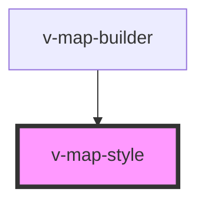

# v-map-style

<!-- Auto Generated Below -->

## Properties

| Property       | Attribute       | Description                                                                                  | Type                                                            | Default     |
| -------------- | --------------- | -------------------------------------------------------------------------------------------- | --------------------------------------------------------------- | ----------- |
| `autoApply`    | `auto-apply`    | Whether to automatically apply the style when loaded.                                        | `boolean`                                                       | `true`      |
| `content`      | `content`       | Inline style content as string (alternative to src).                                         | `string`                                                        | `undefined` |
| `format`       | `format`        | The styling format to parse (currently supports 'sld').                                      | `"cesium-3d-tiles" \| "lyrx" \| "mapbox-gl" \| "qgis" \| "sld"` | `'sld'`     |
| `layerTargets` | `layer-targets` | Target layer IDs to apply this style to. If not specified, applies to all compatible layers. | `string`                                                        | `undefined` |
| `src`          | `src`           | The style source - can be a URL to fetch from or inline SLD/style content.                   | `string`                                                        | `undefined` |

## Events

| Event        | Description                                                 | Type                                              |
| ------------ | ----------------------------------------------------------- | ------------------------------------------------- |
| `styleError` | Fired when style parsing fails.                             | `CustomEvent<Error>`                              |
| `styleReady` | Fired when style is successfully parsed and ready to apply. | `CustomEvent<Style \| { [x: string]: unknown; }>` |

## Methods

### `getStyle() => Promise<ResolvedStyle | undefined>`

Get the currently parsed style.

#### Returns

Type: `Promise<ResolvedStyle>`

## Dependencies

### Used by

 - [v-map-builder](../v-map-builder)

### Graph

----------------------------------------------

*Built with [StencilJS](https://stenciljs.com/)*
