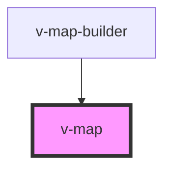

# v-map

<!-- Auto Generated Below -->

## Properties

| Property              | Attribute                | Description                                                                                                            | Type                                          | Default |
| --------------------- | ------------------------ | ---------------------------------------------------------------------------------------------------------------------- | --------------------------------------------- | ------- |
| `center`              | `center`                 | Mittelpunkt der Karte im **WGS84**-Koordinatensystem. Erwartet [lon, lat] (Längengrad, Breitengrad).                   | `string`                                      | `'0,0'` |
| `cssMode`             | `css-mode`               | Aktiviert ein „CSS-Only“-Rendering (z. B. für einfache Tests/Layouts). Bei `true` werden keine Provider initialisiert. | `"bundle" \| "cdn" \| "inline-min" \| "none"` | `'cdn'` |
| `flavour`             | `flavour`                | Zu verwendender Karten-Provider. Unterstützte Werte: "ol" \| "leaflet" \| "cesium" \| "deck".                          | `"cesium" \| "deck" \| "leaflet" \| "ol"`     | `'ol'`  |
| `useDefaultImportMap` | `use-default-import-map` | Falls true, injiziert v-map automatisch die Import-Map.                                                                | `boolean`                                     | `true`  |
| `zoom`                | `zoom`                   | Anfangs-Zoomstufe. Skala abhängig vom Provider (typisch 0–20).                                                         | `number`                                      | `2`     |

## Events

| Event              | Description                                                                                                                        | Type                             |
| ------------------ | ---------------------------------------------------------------------------------------------------------------------------------- | -------------------------------- |
| `mapProviderReady` | Wird ausgelöst, sobald der Karten-Provider initialisiert wurde und Layers entgegennimmt. `detail` enthält `{ provider, flavour }`. | `CustomEvent<MapProviderDetail>` |

## Methods

### `isMapProviderReady() => Promise<boolean>`

Gibt zurück, ob der Karten-Provider initialisiert wurde und verwendet werden kann.

#### Returns

Type: `Promise<boolean>`

Promise mit `true`, sobald der Provider bereit ist, sonst `false`.

### `setView(coordinates: [number, number], zoom: number) => Promise<void>`

Setzt Kartenzentrum und Zoom (optional animiert).

#### Parameters

| Name          | Type               | Description |
| ------------- | ------------------ | ----------- |
| `coordinates` | `[number, number]` |             |
| `zoom`        | `number`           | Zoomstufe   |

#### Returns

Type: `Promise<void>`

## Dependencies

### Used by

 - [v-map-builder](../v-map-builder)

### Graph

----------------------------------------------

*Built with [StencilJS](https://stenciljs.com/)*
